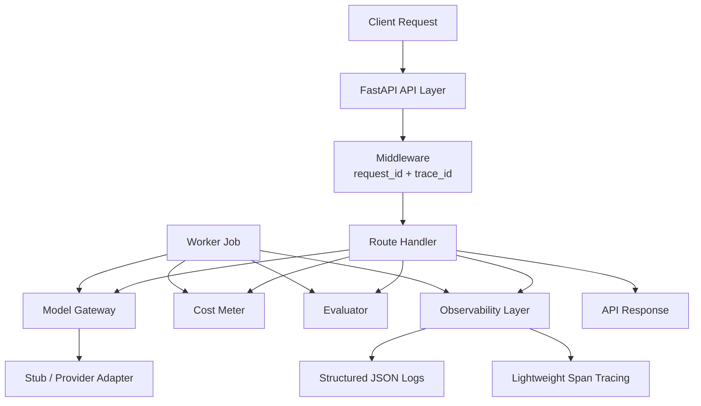

This document will describe the architecture of the reference system.
Topics:
- service boundaries
- data flow
- async ingestion pipeline
- model gateway

# 01 — Architecture

## Overview

Maester is a minimal **AI Reliability Toolkit** for production-minded AI APIs.

It is intentionally scoped around four reliability primitives:

- **Observability** — structured logs and lightweight tracing
- **Cost Metering** — token and request cost accounting
- **Evaluation** — basic response quality checks
- **Execution Separation** — API path and worker path share the same reliability layer

The goal is not to build a full platform.  
The goal is to show the minimum reliability architecture an AI API should have.

---

## System Architecture
*Mermaid chart*



## Repository Layering
maester/
  apps/
    api/         # HTTP entrypoint
    worker/      # background execution example

  packages/
    common/          # shared primitives
    observability/   # logging + tracing
    model_gateway/   # model invocation + pricing + metering
    evaluation/      # response checks

  infra/         # local runtime
  docs/          # architecture + decisions + cost model

  ## Request Lifecycle
  *Mermaid chart*
  ```Mermaid
  sequenceDiagram
    participant Client
    participant API as FastAPI API
    participant MW as Middleware
    participant Route as Route Handler
    participant Trace as Tracing
    participant Gateway as Model Gateway
    participant Meter as Cost Meter
    participant Eval as Evaluator
    participant Logs as Structured Logs

    Client->>API: POST /v1/reliable_completion
    API->>MW: incoming request
    MW->>Trace: start_trace()
    MW->>Logs: bind request_id + trace_id

    API->>Route: reliable_completion()

    Route->>Trace: span(model_generate)
    Route->>Gateway: generate(prompt, model)
    Gateway-->>Route: content + token usage

    Route->>Trace: span(cost_metering)
    Route->>Meter: record(model, usage)
    Meter-->>Route: cost record

    Route->>Trace: span(evaluation)
    Route->>Eval: evaluate(prompt, response)
    Eval-->>Route: evaluation result

    Route->>Logs: emit structured completion event
    Route-->>Client: response + trace_id + cost + evaluation
```


## Reliability Components
### 1. Observability Layer

The observability layer includes:
- logging.py
- tracing.py

Its purpose is to make every request:
- traceable
- inspectable
- measurable

It provides:
- structured JSON logs
- request-scoped IDs
- trace/span timing
- error-aware span lifecycle logging
This is application-level reliability observability, not a full telemetry platform.

### 2. Model Gateway
The model gateway provides a stable interface for model calls.
Current scope:
- demo/stub generation
- usage estimation
- provider boundary

Future scope:
- OpenAI
- Anthropic
- LiteLLM
- local model adapters

The gateway isolates model-provider concerns from route logic.

### 3. Cost Metering

The cost metering layer answers:
- how many tokens were consumed?
- what did this request cost?
- what model generated the cost?

This is critical for production AI systems because reliability is not only about correctness.

It is also about economic visibility.

### 4. Evaluation Layer
The evaluation layer performs lightweight checks on outputs, such as:
- non-empty response
- required term presence
- max-length compliance

This demonstrates a core principle:
> model outputs should be checked, not blindly trusted

The current evaluator is intentionally simple, but the architecture allows richer evaluators later.

### 5. Worker Path
Maester includes a worker example to show that the same reliability layer can be reused outside HTTP requests.

This matters because production AI systems often run through:
- background jobs
- async processing
- queued pipelines
- offline evaluation tasks

So the worker demonstrates that:
- tracing
- cost metering
- evaluation
- structured logs
are not tied only to web APIs.